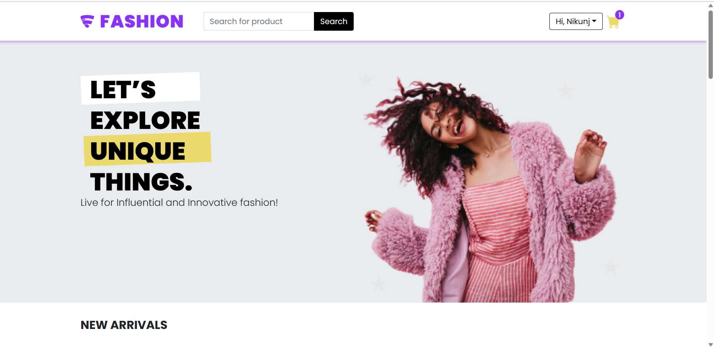
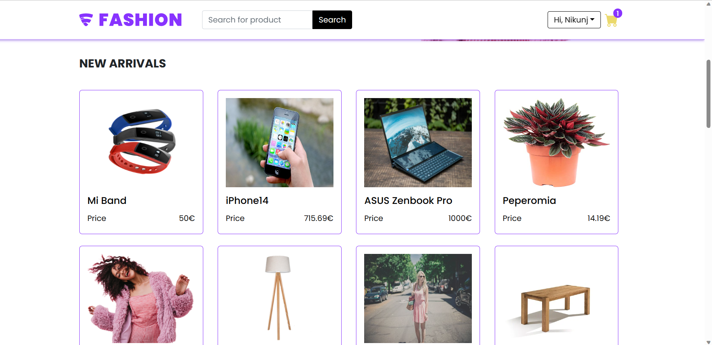
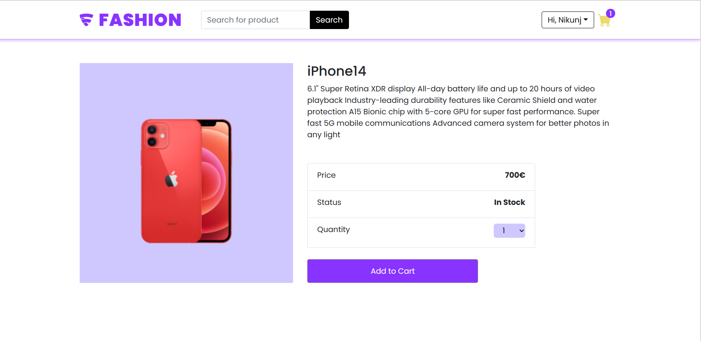
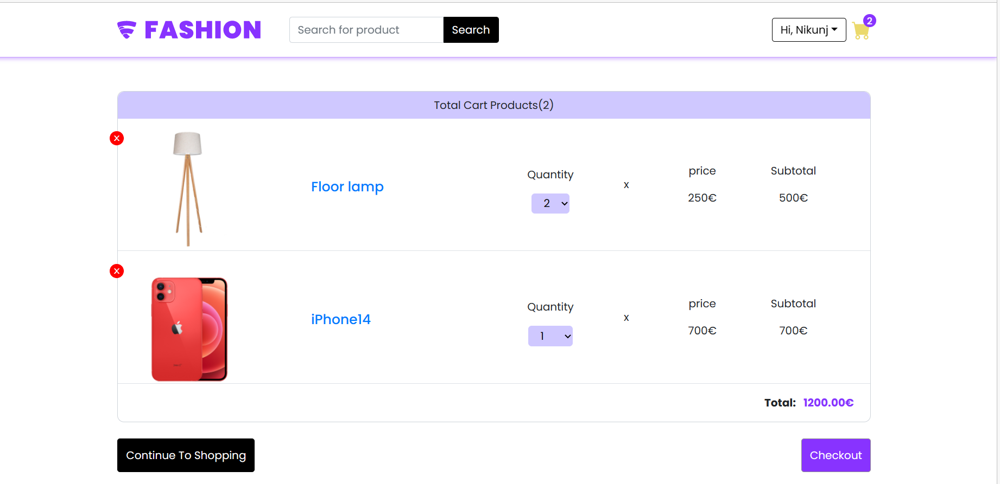
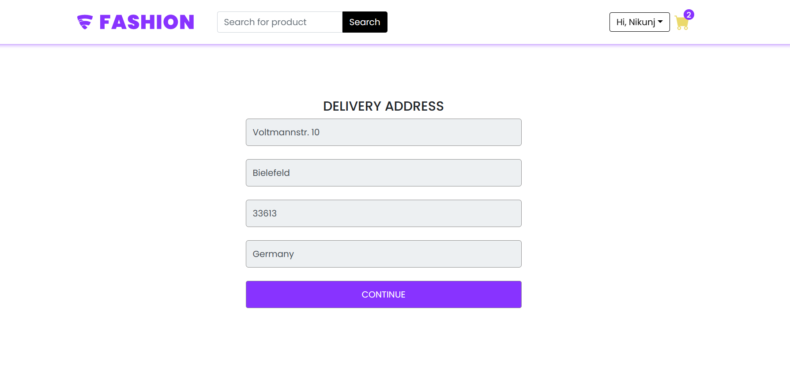
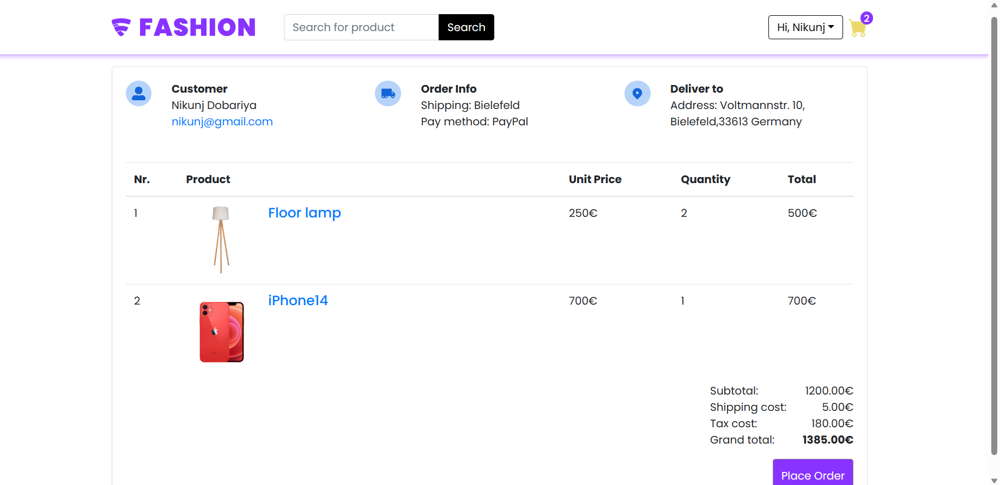
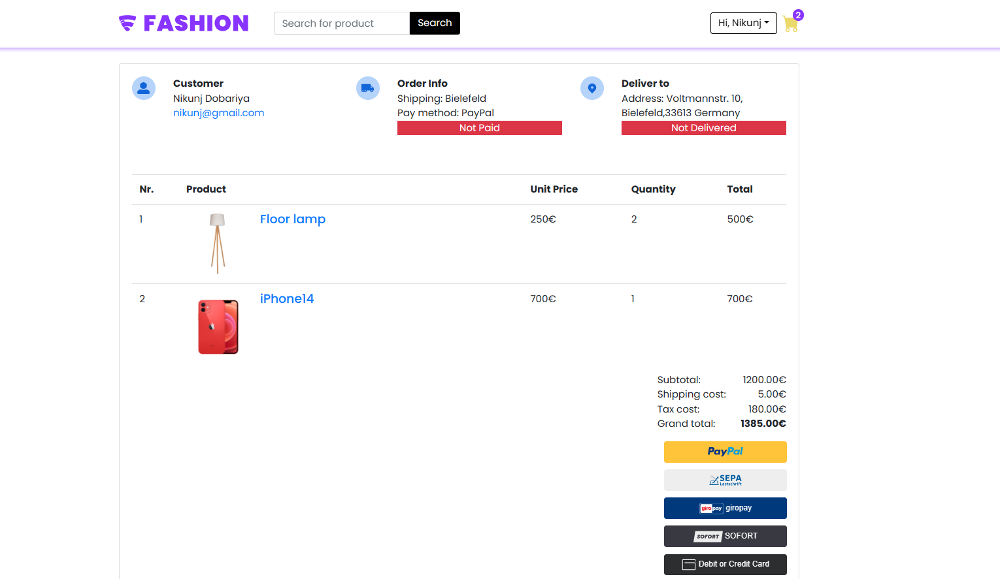
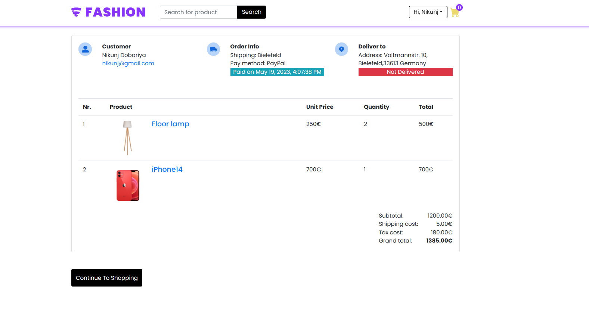

# WareTrack Shop

This project is an e-commerce application where users can browse and purchase various products. It provides a seamless shopping experience with features such as product listing, cart management, and order placement. Additionally, it includes an admin panel to manage the shop.

## Key Features

- Browse a wide range of products
- View detailed product information
- Add products to the shopping cart
- Manage the contents of the shopping cart
- Place orders for the selected products
- Track order status and shipment details

## Technologies Used WareTrack

- Front-end: React.js, HTML, CSS
- Back-end: Node.js, Express.js
- Database: MongoDB
- Authentication: JSON Web Tokens (JWT)
- Payment Integration: Stripe
- Admin Panel: React Admin
- Other Libraries and Tools: Redux, React Router, Axios, Bootstrap

## Usage

- Create an account or log in to your existing account.
- View detailed product information by clicking on a specific product.
- Add desired products to your shopping cart.
- Manage the contents of your shopping cart by adjusting quantities or removing items.
- Proceed to the checkout page and enter your shipping and payment details.
- Confirm your order and complete the payment process using Stripe integration.
- Track the status of your order and view shipment details.
- Enjoy your purchased products!

## Images

